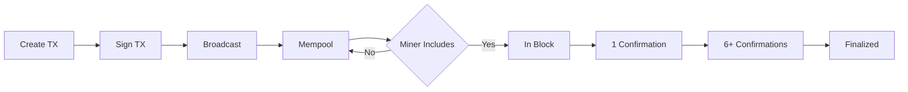

# Your First Transaction

Step-by-step guide to creating and sending your first BitCell transaction.

## Prerequisites

- BitCell node running and synced
- BitCell wallet installed
- Some CELL tokens (from faucet or mining)

## Overview

A BitCell transaction transfers CELL tokens from one address to another. Transactions require:

1. **Sender address** - Your wallet address
2. **Recipient address** - Where to send tokens
3. **Amount** - How much to send
4. **Fee** - Network transaction fee
5. **Signature** - Proof you control the sender address

## Step 1: Check Your Balance

First, verify you have tokens:

```bash
# Using CLI wallet
bitcell-wallet balance

# Output:
# Address: 0x742d35Cc6634C0532925a3b844Bc9e7595f0bEb
# Balance: 100.0 CELL
# Available: 100.0 CELL (no pending transactions)
```

If balance is zero, get testnet tokens:

```bash
# Request from faucet
curl -X POST https://faucet.testnet.bitcell.network/request \
  -H "Content-Type: application/json" \
  -d '{"address": "YOUR_ADDRESS"}'

# Or mine some blocks (if you're a miner)
bitcell-node mine --rounds 10
```

## Step 2: Get Recipient Address

You need a valid BitCell address to send to. Addresses start with `0x` and are 40 hex characters.

Example valid address:
```
0x1234567890123456789012345678901234567890
```

To get someone else's address, ask them for their wallet address:

```bash
# They run this command
bitcell-wallet address

# Or use the GUI wallet (Address tab)
```

## Step 3: Estimate Transaction Fee

Transaction fees depend on network congestion:

```bash
# Get current fee estimate
bitcell-wallet estimate-fee

# Output:
# Current gas price: 0.001 CELL
# Estimated fee for standard transfer: 0.001 CELL
# Estimated fee for contract call: 0.005 CELL
```

## Step 4: Create Transaction

### Using CLI Wallet

```bash
# Basic send command
bitcell-wallet send \
  --to 0x1234567890123456789012345678901234567890 \
  --amount 10 \
  --fee 0.001

# You'll be prompted for your wallet password:
# Enter wallet password: ********
#
# ✓ Transaction created
# ✓ Transaction signed
# ✓ Broadcasting to network...
# ✓ Transaction hash: 0xabcd...ef12
```

### Using GUI Wallet

1. Open BitCell GUI Wallet
2. Click **Send** tab
3. Fill in the form:
   - **To**: `0x1234567890123456789012345678901234567890`
   - **Amount**: `10`
   - **Fee**: `0.001` (or use "Auto" for automatic estimation)
4. Click **Send Transaction**
5. Enter your password
6. Click **Confirm**

### Advanced Options

Specify additional parameters:

```bash
# With custom nonce (for replacing pending tx)
bitcell-wallet send \
  --to 0x1234... \
  --amount 10 \
  --fee 0.001 \
  --nonce 42

# With data payload (for contract interaction)
bitcell-wallet send \
  --to 0xcontract... \
  --amount 0 \
  --fee 0.005 \
  --data 0x1234abcd...

# Dry run (simulate without sending)
bitcell-wallet send \
  --to 0x1234... \
  --amount 10 \
  --fee 0.001 \
  --dry-run
```

## Step 5: Track Transaction Status

After sending, track your transaction:

### Check Mempool Status

```bash
# View pending transactions
bitcell-wallet pending

# Output:
# Pending Transactions:
# Hash: 0xabcd...ef12
# To: 0x1234...7890
# Amount: 10 CELL
# Fee: 0.001 CELL
# Status: In mempool (waiting for inclusion)
```

### Wait for Confirmation

Transactions typically confirm in:
- **Testnet**: 15-30 seconds (15s block time)
- **Mainnet**: 60-120 seconds (60s block time)

```bash
# Watch transaction status
bitcell-wallet status 0xabcd...ef12

# Output:
# Transaction: 0xabcd...ef12
# Status: Confirmed
# Block: 10893
# Confirmations: 6
# Gas used: 21000
```

### Using the Block Explorer

View transaction details in the browser:

```
https://explorer.testnet.bitcell.network/tx/0xabcd...ef12
```

## Step 6: Verify Receipt

Confirm the transaction was successful:

```bash
# Check your new balance
bitcell-wallet balance

# Output:
# Balance: 89.999 CELL
# (100 - 10 - 0.001 = 89.999)

# Check transaction history
bitcell-wallet history

# Output:
# Recent Transactions:
# 1. Sent 10 CELL to 0x1234...7890 (block 10893)
#    Fee: 0.001 CELL | Hash: 0xabcd...ef12
```

## Transaction Lifecycle

Understanding what happens to your transaction:



### Transaction States

1. **Created**: Transaction built locally
2. **Signed**: Cryptographically signed with your private key
3. **Broadcast**: Sent to network peers
4. **In Mempool**: Waiting for miner to include in block
5. **Pending (1 conf)**: Included in a block
6. **Confirmed (6 conf)**: Considered final

## Transaction Fees Explained

### Fee Calculation

```
Total Cost = Amount + Fee
Fee = Gas Used × Gas Price
```

For a simple transfer:
- Gas Used: 21,000 units (fixed)
- Gas Price: Variable (depends on network)
- Fee: ~0.001 CELL (typical)

### Fee Market

During congestion, increase gas price to get faster inclusion:

```bash
# Low priority (cheap, slower)
bitcell-wallet send --to 0x... --amount 10 --gas-price 0.0005

# Standard priority (recommended)
bitcell-wallet send --to 0x... --amount 10 --gas-price 0.001

# High priority (expensive, faster)
bitcell-wallet send --to 0x... --amount 10 --gas-price 0.005
```

## Common Issues

### "Insufficient balance"

You don't have enough CELL for `amount + fee`:

```bash
# Check balance
bitcell-wallet balance

# Reduce amount or fee
bitcell-wallet send --to 0x... --amount 5 --fee 0.0005
```

### "Invalid recipient address"

Address format is incorrect:

```bash
# Valid: starts with 0x, 40 hex chars
0x742d35Cc6634C0532925a3b844Bc9e7595f0bEb ✓

# Invalid: missing 0x
742d35Cc6634C0532925a3b844Bc9e7595f0bEb ✗

# Invalid: wrong length
0x742d35Cc6634C05 ✗

# Invalid: contains non-hex chars
0x742d35Cc6634C0532925a3b844Bc9eZZZZf0bEb ✗
```

### "Nonce too low"

You're trying to send a transaction with a nonce that's already used:

```bash
# Get current nonce
bitcell-wallet nonce

# Use the returned nonce
bitcell-wallet send --to 0x... --amount 10 --nonce <returned_nonce>
```

### "Transaction replaced"

Your transaction was replaced by another with higher fee:

```bash
# Send replacement transaction with higher fee
bitcell-wallet send \
  --to 0x... \
  --amount 10 \
  --fee 0.002 \
  --nonce <same_nonce>
```

### "Transaction stuck"

Transaction pending for too long:

```bash
# Option 1: Wait (might eventually confirm)

# Option 2: Speed up (send with same nonce, higher fee)
bitcell-wallet speedup 0xabcd...ef12

# Option 3: Cancel (send 0 CELL to yourself, same nonce, higher fee)
bitcell-wallet cancel 0xabcd...ef12
```

## Best Practices

### Security

- ✓ Always verify recipient address before sending
- ✓ Start with small test transactions
- ✓ Wait for 6+ confirmations for large amounts
- ✓ Keep your private key/recovery phrase secure
- ✗ Never share your private key or recovery phrase

### Efficiency

- Use automatic fee estimation for most transactions
- Batch multiple payments when possible
- Monitor network congestion (check mempool size)
- Consider using lower fees during off-peak hours

### Record Keeping

```bash
# Export transaction history
bitcell-wallet export-history --format csv --output transactions.csv

# Get tax report
bitcell-wallet tax-report --year 2024 --output tax-report-2024.pdf
```

## Next Steps

Now that you've sent your first transaction, explore:

- **[Account Management](../wallet/account-management.md)** - Multiple accounts
- **[Smart Contracts](../contracts/deployment.md)** - Interact with contracts
- **[API Integration](../api/json-rpc.md)** - Programmatic transactions

## Advanced Topics

### Batch Transactions

Send multiple transactions efficiently:

```bash
# Create batch file (batch.json)
cat > batch.json <<EOF
[
  {"to": "0x1111...", "amount": "10"},
  {"to": "0x2222...", "amount": "20"},
  {"to": "0x3333...", "amount": "30"}
]
EOF

# Send batch
bitcell-wallet send-batch --file batch.json --fee-each 0.001
```

### Multi-Signature Transactions

For shared accounts (requires contract deployment):

```bash
# Create multisig wallet (2-of-3)
bitcell-wallet multisig create \
  --owners 0x1111...,0x2222...,0x3333... \
  --threshold 2

# Propose transaction
bitcell-wallet multisig propose \
  --wallet 0xmultisig... \
  --to 0xrecipient... \
  --amount 100

# Co-signers approve
bitcell-wallet multisig approve \
  --wallet 0xmultisig... \
  --proposal-id 1
```

For more details, see [Advanced Wallet Features](../wallet/account-management.md#multi-signature).
